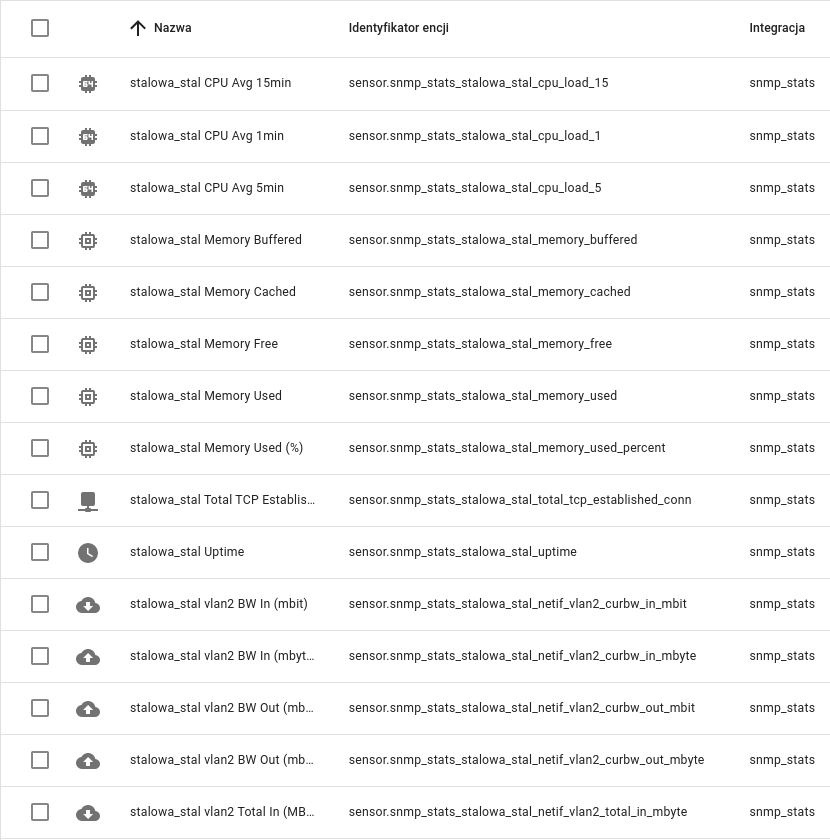

# ha_snmp_stats
Homeassistant integration to show some stats from snmp
netif - bandwidth
netif - total traffic
cpu load averages (1/2/3)
..more to come

Modified version, based on original repo by @weltmeyer. Added more features like
- Community configuration from setup
- Added 1 min / 5 min / 15 min load
- Added Uptime
- Added count of TCP Established connections
- Added Memory
- Added Polish and English translation
- Fixed minor bugs

### Tested working with ###
* opnsense 20
* openWRT
* FreshTomato

### Important: ###
Set the update interval in the Integration Settings. Default is 1 second, which may kill your recorder database.

This is a very quick modification to use on my own. Don't bother code quality - i know it could be better, but it works stable.
And that's what i needed :)

### Install ###
Easiest way is to add this repository to hacs.

### Screenshots :) ###

